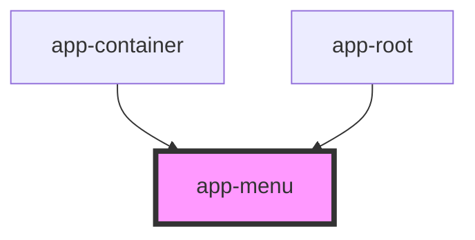

# app-menu-item

<!-- Auto Generated Below -->

## Properties

| Property            | Attribute             | Description | Type         | Default     |
| ------------------- | --------------------- | ----------- | ------------ | ----------- |
| `hamburgerMaxWidth` | `hamburger-max-width` |             | `number`     | `600`       |
| `itemRenderer`      | `item-renderer`       |             | `string`     | `undefined` |
| `menuItems`         | --                    |             | `MenuItem[]` | `null`      |

## Events

| Event           | Description | Type               |
| --------------- | ----------- | ------------------ |
| `menuEvent`     |             | `CustomEvent<any>` |
| `needMenuItems` |             | `CustomEvent<any>` |

## Dependencies

### Used by

 - [app-container](../app-container)
 - [app-root](../app-root)

### Graph

----------------------------------------------

*Built with [StencilJS](https://stenciljs.com/)*
