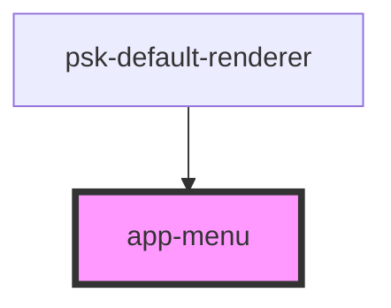

# app-menu-item

<!-- Auto Generated Below -->

## Properties

| Property            | Attribute             | Description | Type                             | Default     |
| ------------------- | --------------------- | ----------- | -------------------------------- | ----------- |
| `hamburgerMaxWidth` | `hamburger-max-width` |             | `number`                         | `600`       |
| `historyType`       | `history-type`        |             | `"browser" \| "hash" \| "query"` | `undefined` |
| `itemRenderer`      | `item-renderer`       |             | `string`                         | `undefined` |
| `menuItems`         | --                    |             | `MenuItem[]`                     | `null`      |

## Events

| Event            | Description | Type               |
| ---------------- | ----------- | ------------------ |
| `getHistoryType` |             | `CustomEvent<any>` |
| `menuEvent`      |             | `CustomEvent<any>` |
| `needMenuItems`  |             | `CustomEvent<any>` |

## Dependencies

### Used by

 - [psk-default-renderer](..\renderers\app-root-renders)

### Graph

----------------------------------------------

*Built with [StencilJS](https://stenciljs.com/)*
