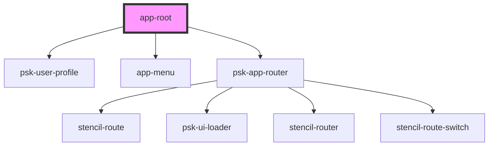

# app-root

<!-- Auto Generated Below -->

## Properties

| Property     | Attribute    | Description | Type            | Default     |
| ------------ | ------------ | ----------- | --------------- | ----------- |
| `controller` | `controller` |             | `any`           | `undefined` |
| `history`    | --           |             | `RouterHistory` | `undefined` |

## Events

| Event          | Description | Type               |
| -------------- | ----------- | ------------------ |
| `routeChanged` |             | `CustomEvent<any>` |

## Dependencies

### Depends on

- [psk-user-profile](../psk-user-profile)
- [app-menu](../app-menu)
- [psk-app-router](../psk-app-router)

### Graph

----------------------------------------------

*Built with [StencilJS](https://stenciljs.com/)*
