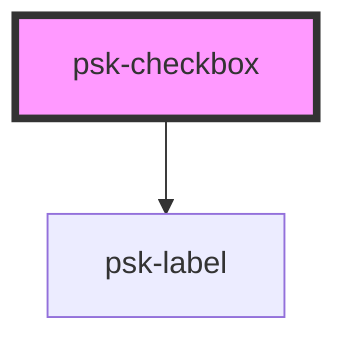

# psk-checkbox

<!-- Auto Generated Below -->

## Properties

| Property         | Attribute         | Description | Type      | Default       |
| ---------------- | ----------------- | ----------- | --------- | ------------- |
| `checkboxLabel`  | `checkbox-label`  |             | `any`     | `undefined`   |
| `checkedValue`   | `checked-value`   |             | `string`  | `null`        |
| `isChecked`      | `is-checked`      |             | `boolean` | `false`       |
| `labelValue`     | `label-value`     |             | `string`  | `undefined`   |
| `name`           | `name`            |             | `string`  | `null`        |
| `required`       | `required`        |             | `boolean` | `false`       |
| `selectedValue`  | `selected-value`  |             | `string`  | `'unchecked'` |
| `uncheckedValue` | `unchecked-value` |             | `string`  | `null`        |

## Dependencies

### Depends on

- [psk-label](../psk-label)

### Graph

----------------------------------------------

*Built with [StencilJS](https://stenciljs.com/)*
