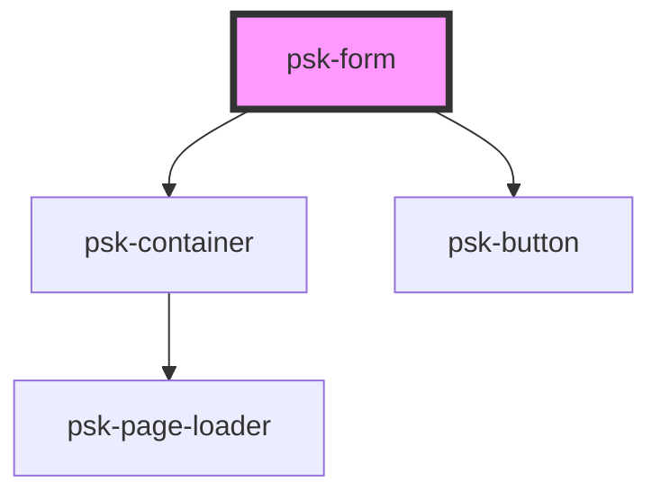

# psk-form

<!-- Auto Generated Below -->

## Properties

| Property         | Attribute         | Description | Type     | Default            |
| ---------------- | ----------------- | ----------- | -------- | ------------------ |
| `action`         | `action`          |             | `string` | `null`             |
| `controllerName` | `controller-name` |             | `string` | `"FormController"` |
| `formActions`    | `form-actions`    |             | `string` | `'submit'`         |
| `method`         | `method`          |             | `string` | `'get'`            |

## Dependencies

### Depends on

- [psk-container](../../psk-container)
- [psk-button](../../psk-button)

### Graph

----------------------------------------------

*Built with [StencilJS](https://stenciljs.com/)*
