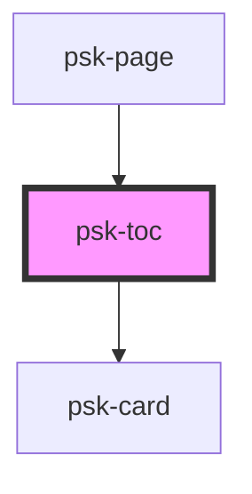

# psk-page

<!-- Auto Generated Below -->

## Properties

| Property      | Attribute | Description | Type          | Default     |
| ------------- | --------- | ----------- | ------------- | ----------- |
| `chapterList` | --        |             | `Chapter[]`   | `[]`        |
| `pageElement` | --        |             | `HTMLElement` | `undefined` |
| `title`       | `title`   |             | `string`      | `undefined` |

## Dependencies

### Used by

 - [psk-page]()

### Depends on

- [psk-card]()

### Graph

----------------------------------------------

*Built with [StencilJS](https://stenciljs.com/)*
