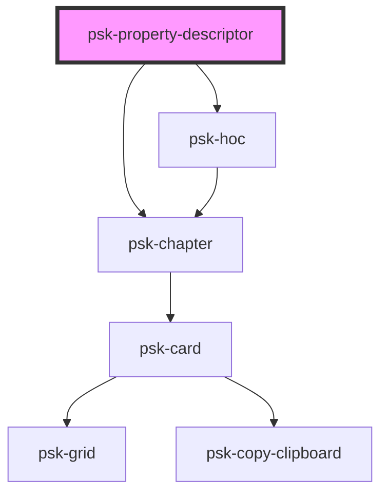

# psk-page

<!-- Auto Generated Below -->

## Properties

| Property | Attribute | Description | Type     | Default |
| -------- | --------- | ----------- | -------- | ------- |
| `title`  | `title`   |             | `string` | `""`    |

## Dependencies

### Depends on

- [psk-hoc]()
- [psk-chapter](..\psk-chapter)

### Graph

----------------------------------------------

*Built with [StencilJS](https://stenciljs.com/)*
