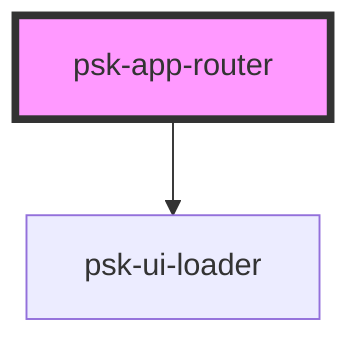

# psk-app-router

<!-- Auto Generated Below -->

## Properties

| Property    | Attribute | Description | Type         | Default |
| ----------- | --------- | ----------- | ------------ | ------- |
| `menuItems` | --        |             | `MenuItem[]` | `[]`    |

## Events

| Event           | Description | Type               |
| --------------- | ----------- | ------------------ |
| `needMenuItems` |             | `CustomEvent<any>` |

## Dependencies

### Depends on

- [psk-ui-loader](..\psk-ui-loader)

### Graph

----------------------------------------------

*Built with [StencilJS](https://stenciljs.com/)*
