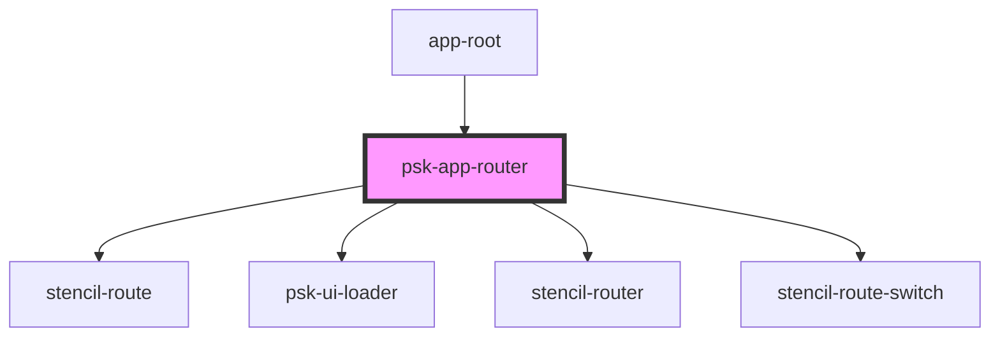

# psk-app-router

<!-- Auto Generated Below -->

## Properties

| Property         | Attribute          | Description | Type         | Default     |
| ---------------- | ------------------ | ----------- | ------------ | ----------- |
| `failRedirectTo` | `fail-redirect-to` |             | `string`     | `""`        |
| `historyType`    | `history-type`     |             | `string`     | `"browser"` |
| `menuItems`      | --                 |             | `MenuItem[]` | `[]`        |

## Events

| Event           | Description | Type               |
| --------------- | ----------- | ------------------ |
| `needMenuItems` |             | `CustomEvent<any>` |

## Dependencies

### Used by

 - [app-root](../app-root)

### Depends on

- stencil-route
- [psk-ui-loader](../psk-ui-loader)
- stencil-router
- stencil-route-switch

### Graph

----------------------------------------------

*Built with [StencilJS](https://stenciljs.com/)*
