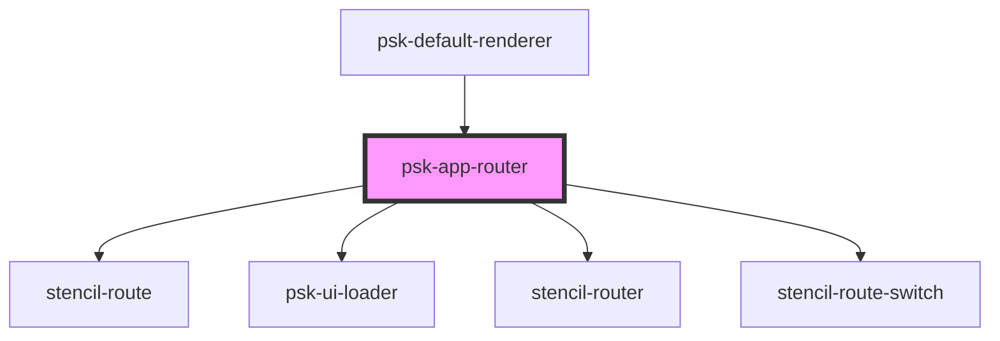

# psk-app-router

<!-- Auto Generated Below -->

## Properties

| Property         | Attribute          | Description | Type                             | Default     |
| ---------------- | ------------------ | ----------- | -------------------------------- | ----------- |
| `failRedirectTo` | `fail-redirect-to` |             | `string`                         | `""`        |
| `historyType`    | `history-type`     |             | `"browser" \| "hash" \| "query"` | `undefined` |
| `menuItems`      | --                 |             | `MenuItem[]`                     | `[]`        |

## Events

| Event            | Description | Type               |
| ---------------- | ----------- | ------------------ |
| `getHistoryType` |             | `CustomEvent<any>` |
| `needMenuItems`  |             | `CustomEvent<any>` |

## Dependencies

### Used by

 - [psk-default-renderer](../renderers/app-root-renders)

### Depends on

- stencil-route
- [psk-ui-loader](../psk-ui-loader)
- stencil-router
- stencil-route-switch

### Graph

----------------------------------------------

*Built with [StencilJS](https://stenciljs.com/)*
