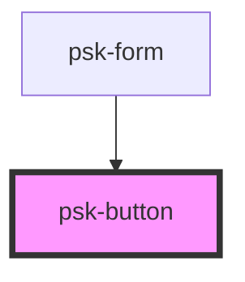

# psk-button

<!-- Auto Generated Below -->

## Properties

| Property               | Attribute                 | Description | Type      | Default             |
| ---------------------- | ------------------------- | ----------- | --------- | ------------------- |
| `buttonClass`          | `button-class`            |             | `string`  | `"btn btn-primary"` |
| `doubleClickEventName` | `double-click-event-name` |             | `string`  | `undefined`         |
| `eventData`            | `event-data`              |             | `any`     | `undefined`         |
| `eventDispatcher`      | `event-dispatcher`        |             | `string`  | `undefined`         |
| `eventName`            | `event-name`              |             | `string`  | `undefined`         |
| `isDisabled`           | `is-disabled`             |             | `boolean` | `false`             |
| `label`                | `label`                   |             | `string`  | `undefined`         |

## Dependencies

### Used by

 - [psk-form](../form-components/psk-form)

### Graph

----------------------------------------------

*Built with [StencilJS](https://stenciljs.com/)*
