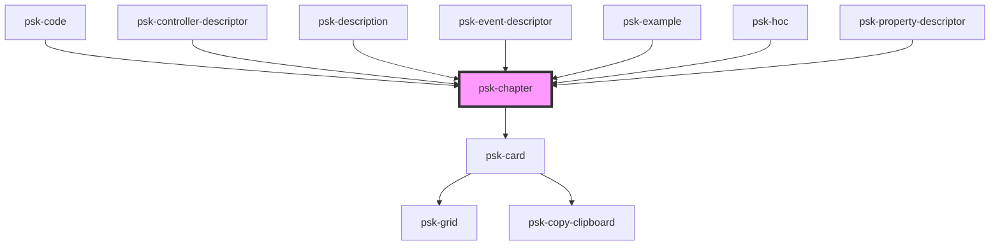

# psk-chapter

<!-- Auto Generated Below -->

## Properties

| Property | Attribute | Description | Type     | Default     |
| -------- | --------- | ----------- | -------- | ----------- |
| `guid`   | `guid`    |             | `string` | `undefined` |
| `title`  | `title`   |             | `string` | `""`        |

## Events

| Event              | Description | Type               |
| ------------------ | ----------- | ------------------ |
| `psk-send-chapter` |             | `CustomEvent<any>` |

## Dependencies

### Used by

 - [psk-code](..\psk-code)
 - [psk-controller-descriptor](..\pages-components)
 - [psk-description](..\psk-description)
 - [psk-event-descriptor](..\pages-components)
 - [psk-example](..\psk-example)
 - [psk-hoc](..\pages-components)
 - [psk-property-descriptor](..\pages-components)

### Depends on

- [psk-card](..\psk-card)

### Graph

----------------------------------------------

*Built with [StencilJS](https://stenciljs.com/)*
