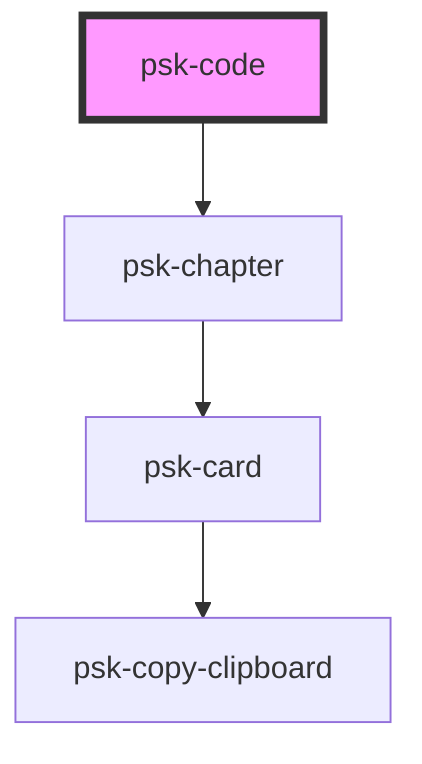

# psk-code

<!-- Auto Generated Below -->

## Properties

| Property   | Attribute  | Description | Type     | Default |
| ---------- | ---------- | ----------- | -------- | ------- |
| `language` | `language` |             | `string` | `''`    |
| `title`    | `title`    |             | `string` | `""`    |

## Dependencies

### Depends on

<<<<<<< Updated upstream
- [psk-chapter](../psk-chapter)
=======
<<<<<<< Updated upstream
- [psk-chapter](../psk-chapter)
=======
- [psk-chapter](..\psk-chapter)
>>>>>>> Stashed changes
>>>>>>> Stashed changes

### Graph

----------------------------------------------

*Built with [StencilJS](https://stenciljs.com/)*
