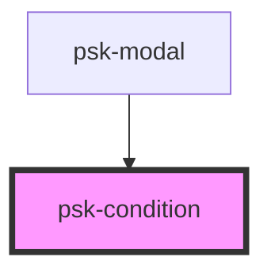

# psk-condition

<!-- Auto Generated Below -->

## Properties

| Property    | Attribute   | Description | Type  | Default |
| ----------- | ----------- | ----------- | ----- | ------- |
| `condition` | `condition` |             | `any` | `null`  |

## Events

| Event           | Description | Type               |
| --------------- | ----------- | ------------------ |
| `getModelEvent` |             | `CustomEvent<any>` |

## Dependencies

### Used by

 - [psk-modal](../psk-modal)

### Graph

----------------------------------------------

*Built with [StencilJS](https://stenciljs.com/)*
