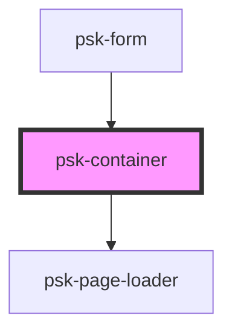

# my-component

<!-- Auto Generated Below -->

## Properties

| Property         | Attribute         | Description | Type     | Default     |
| ---------------- | ----------------- | ----------- | -------- | ----------- |
| `controllerName` | `controller-name` |             | `string` | `undefined` |
| `htmlFilePath`   | `html-file-path`  |             | `string` | `undefined` |

## Dependencies

### Used by

 - [psk-form](..\psk-form)

### Depends on

- [psk-page-loader](..\psk-page-loader)

### Graph

----------------------------------------------

*Built with [StencilJS](https://stenciljs.com/)*
