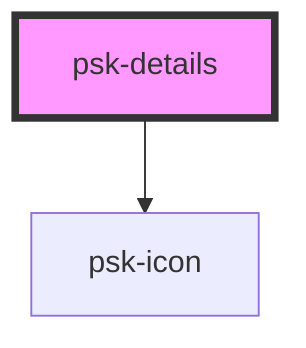

# psk-details

<!-- Auto Generated Below -->

## Properties

| Property  | Attribute | Description | Type      | Default     |
| --------- | --------- | ----------- | --------- | ----------- |
| `opened`  | `opened`  |             | `boolean` | `undefined` |
| `summary` | `summary` |             | `string`  | `undefined` |

## Dependencies

### Depends on

- [psk-icon](../psk-icon)

### Graph

----------------------------------------------

*Built with [StencilJS](https://stenciljs.com/)*
