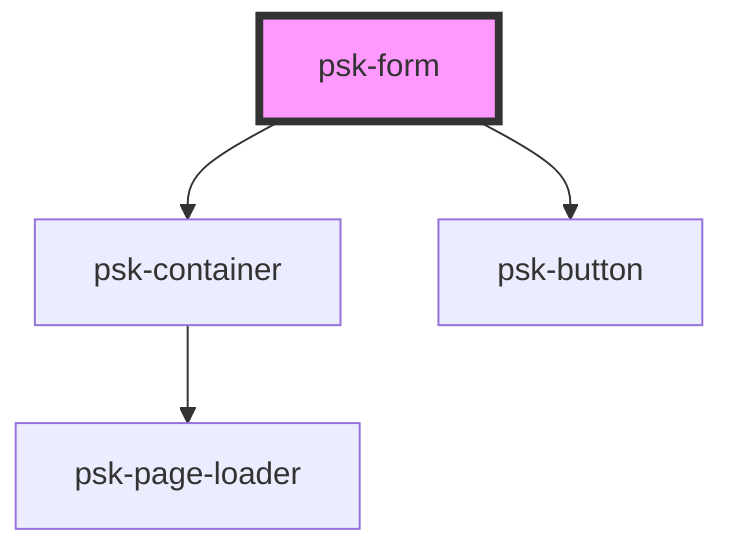

# psk-form

<!-- Auto Generated Below -->

## Properties

| Property         | Attribute         | Description | Type     | Default     |
| ---------------- | ----------------- | ----------- | -------- | ----------- |
| `controllerName` | `controller-name` |             | `string` | `undefined` |
| `formActions`    | `form-actions`    |             | `string` | `'submit'`  |
| `model`          | `model`           |             | `string` | `null`      |

## Dependencies

### Depends on

- [psk-container](..\psk-container)
- [psk-button](..\psk-button)

### Graph

----------------------------------------------

*Built with [StencilJS](https://stenciljs.com/)*
