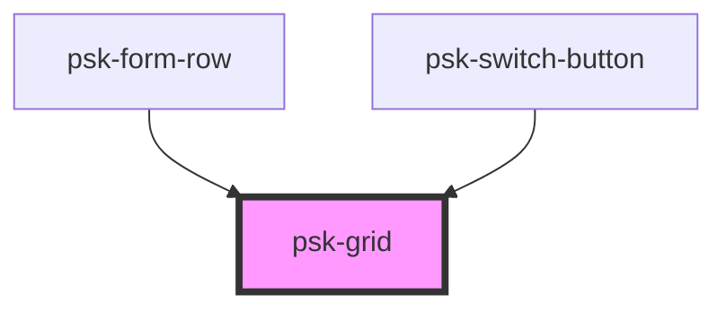

# psk-grid

<!-- Auto Generated Below -->

## Properties

| Property  | Attribute | Description | Type     | Default |
| --------- | --------- | ----------- | -------- | ------- |
| `columns` | `columns` |             | `number` | `null`  |
| `layout`  | `layout`  |             | `string` | `null`  |

## Dependencies

### Used by

 - [psk-form-row](../form-components/psk-form-row)
 - [psk-switch-button](../psk-switch-button)

### Graph

----------------------------------------------

*Built with [StencilJS](https://stenciljs.com/)*
