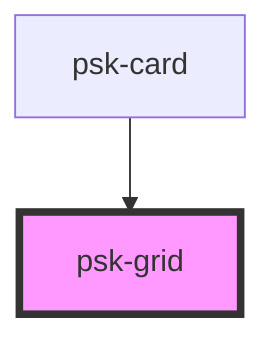

# psk-grid

<!-- Auto Generated Below -->

## Properties

| Property  | Attribute | Description | Type     | Default |
| --------- | --------- | ----------- | -------- | ------- |
| `columns` | `columns` |             | `string` | `"1"`   |

## Dependencies

### Used by

 - [psk-card](..\psk-card)

### Graph

----------------------------------------------

*Built with [StencilJS](https://stenciljs.com/)*
