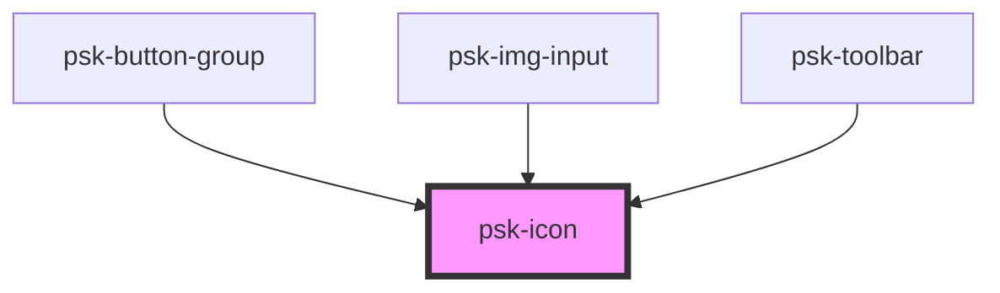

# psk-icon

<!-- Auto Generated Below -->

## Properties

| Property       | Attribute       | Description | Type      | Default                |
| -------------- | --------------- | ----------- | --------- | ---------------------- |
| `classes`      | `classes`       |             | `string`  | `undefined`            |
| `color`        | `color`         |             | `string`  | `'rgba(0, 0, 255, 1)'` |
| `disableColor` | `disable-color` |             | `boolean` | `false`                |
| `icon`         | `icon`          |             | `string`  | `undefined`            |

## Dependencies

### Used by

 - [psk-button-group](../psk-button-group)
 - [psk-img-input](../form-components/psk-img-input)
 - [psk-toolbar](../psk-toolbar)

### Graph

----------------------------------------------

*Built with [StencilJS](https://stenciljs.com/)*
