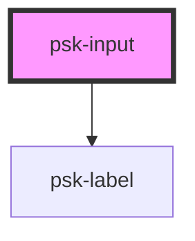

# psk-input

<!-- Auto Generated Below -->

## Properties

| Property       | Attribute       | Description | Type      | Default  |
| -------------- | --------------- | ----------- | --------- | -------- |
| `invalidValue` | `invalid-value` |             | `boolean` | `null`   |
| `label`        | `label`         |             | `string`  | `null`   |
| `name`         | `name`          |             | `string`  | `null`   |
| `parentChain`  | `parent-chain`  |             | `string`  | `null`   |
| `placeholder`  | `placeholder`   |             | `string`  | `null`   |
| `readOnly`     | `read-only`     |             | `boolean` | `false`  |
| `required`     | `required`      |             | `boolean` | `false`  |
| `rootModel`    | `root-model`    |             | `any`     | `null`   |
| `type`         | `type`          |             | `string`  | `'text'` |
| `value`        | `value`         |             | `string`  | `null`   |

## Dependencies

### Depends on

- [psk-label](..\psk-label)

### Graph

----------------------------------------------

*Built with [StencilJS](https://stenciljs.com/)*
