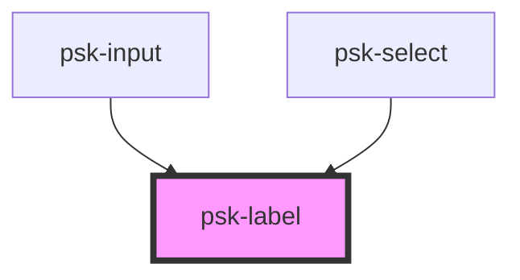

# psk-label

<!-- Auto Generated Below -->

## Properties

| Property | Attribute | Description | Type     | Default |
| -------- | --------- | ----------- | -------- | ------- |
| `for`    | `for`     |             | `string` | `null`  |
| `label`  | `label`   |             | `string` | `null`  |

## Dependencies

### Used by

 - [psk-input](..\psk-input)
 - [psk-select](..\psk-select)

### Graph

----------------------------------------------

*Built with [StencilJS](https://stenciljs.com/)*
