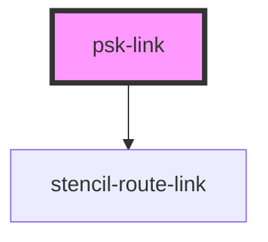

# psk-link

<!-- Auto Generated Below -->

## Properties

| Property | Attribute | Description | Type     | Default     |
| -------- | --------- | ----------- | -------- | ----------- |
| `page`   | `page`    |             | `string` | `undefined` |

## Events

| Event         | Description | Type               |
| ------------- | ----------- | ------------------ |
| `validateUrl` |             | `CustomEvent<any>` |

## Dependencies

### Depends on

- stencil-route-link

### Graph

----------------------------------------------

*Built with [StencilJS](https://stenciljs.com/)*
