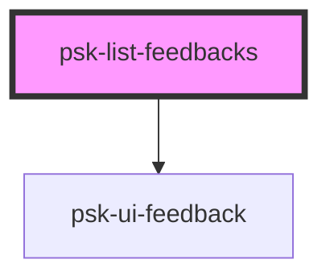

# psk-list-feedbacks

<!-- Auto Generated Below -->

## Properties

| Property            | Attribute             | Description | Type     | Default            |
| ------------------- | --------------------- | ----------- | -------- | ------------------ |
| `hour`              | `hour`                |             | `number` | `60 * this.minute` |
| `messagesToDisplay` | `messages-to-display` |             | `number` | `3`                |
| `minute`            | `minute`              |             | `number` | `60 * this.second` |
| `second`            | `second`              |             | `number` | `1000`             |

## Events

| Event          | Description | Type               |
| -------------- | ----------- | ------------------ |
| `openFeedback` |             | `CustomEvent<any>` |
| `showFeedback` |             | `CustomEvent<any>` |

## Dependencies

### Depends on

- [psk-ui-feedback](..\psk-ui-feedback)

### Graph

----------------------------------------------

*Built with [StencilJS](https://stenciljs.com/)*
