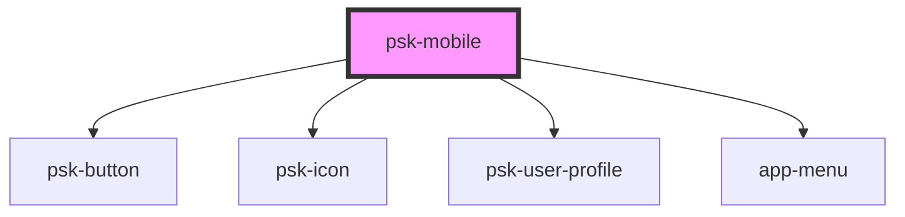

# psk-mobile

<!-- Auto Generated Below -->

## Properties

| Property         | Attribute         | Description | Type            | Default     |
| ---------------- | ----------------- | ----------- | --------------- | ----------- |
| `controllerName` | `controller-name` |             | `string`        | `undefined` |
| `disableBack`    | `disable-back`    |             | `boolean`       | `true`      |
| `disableSidebar` | `disable-sidebar` |             | `boolean`       | `false`     |
| `history`        | --                |             | `RouterHistory` | `undefined` |
| `title`          | `title`           |             | `string`        | `undefined` |

## Events

| Event           | Description | Type               |
| --------------- | ----------- | ------------------ |
| `needMenuItems` |             | `CustomEvent<any>` |

## Dependencies

### Depends on

- [psk-button](../psk-button)
- [psk-icon](../psk-icon)
- [psk-user-profile](../psk-user-profile)
- [app-menu](../app-menu)

### Graph

----------------------------------------------

*Built with [StencilJS](https://stenciljs.com/)*
