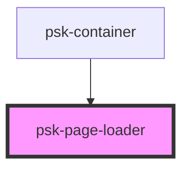

# psk-page-loader

<!-- Auto Generated Below -->

## Properties

| Property  | Attribute  | Description | Type     | Default     |
| --------- | ---------- | ----------- | -------- | ----------- |
| `pageUrl` | `page-url` |             | `string` | `undefined` |

## Dependencies

### Used by

<<<<<<< Updated upstream
 - [psk-container](../psk-container)
=======
<<<<<<< Updated upstream
 - [psk-container](../psk-container)
=======
 - [psk-container](..\psk-container)
>>>>>>> Stashed changes
>>>>>>> Stashed changes

### Graph

----------------------------------------------

*Built with [StencilJS](https://stenciljs.com/)*
