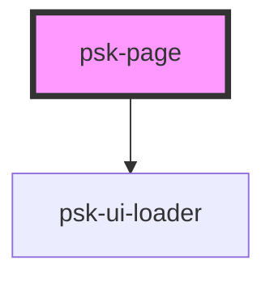

# psk-page

<!-- Auto Generated Below -->

## Properties

| Property   | Attribute   | Description | Type     | Default     |
| ---------- | ----------- | ----------- | -------- | ----------- |
| `title`    | `title`     |             | `string` | `""`        |
| `tocTitle` | `toc-title` |             | `string` | `undefined` |

## Dependencies

### Depends on

<<<<<<< Updated upstream
- [psk-ui-loader](../psk-ui-loader)
=======
<<<<<<< Updated upstream
- [psk-ui-loader](../psk-ui-loader)
=======
- [psk-ui-loader](..\psk-ui-loader)
>>>>>>> Stashed changes
>>>>>>> Stashed changes

### Graph

----------------------------------------------

*Built with [StencilJS](https://stenciljs.com/)*
