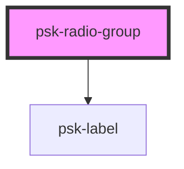

# psk-radio-group

<!-- Auto Generated Below -->

## Properties

| Property        | Attribute        | Description | Type      | Default |
| --------------- | ---------------- | ----------- | --------- | ------- |
| `invalid`       | `invalid`        |             | `boolean` | `true`  |
| `label`         | `label`          |             | `string`  | `null`  |
| `name`          | `name`           |             | `string`  | `null`  |
| `selectedValue` | `selected-value` |             | `string`  | `null`  |

## Dependencies

### Depends on

- [psk-label](..\psk-label)

### Graph

----------------------------------------------

*Built with [StencilJS](https://stenciljs.com/)*
