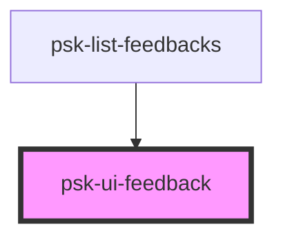

# rms-alert

<!-- Auto Generated Below -->

## Properties

| Property            | Attribute             | Description | Type      | Default          |
| ------------------- | --------------------- | ----------- | --------- | ---------------- |
| `message`           | `message`             |             | `any`     | `undefined`      |
| `opened`            | `opened`              |             | `boolean` | `false`          |
| `timeMeasure`       | `time-measure`        |             | `string`  | `'seconds'`      |
| `timeSinceCreation` | `time-since-creation` |             | `number`  | `undefined`      |
| `typeOfAlert`       | `type-of-alert`       |             | `string`  | `"succes-alert"` |

## Events

| Event           | Description | Type               |
| --------------- | ----------- | ------------------ |
| `closeFeedback` |             | `CustomEvent<any>` |

## Dependencies

### Used by

 - [psk-list-feedbacks](../psk-list-feedbacks)

### Graph

----------------------------------------------

*Built with [StencilJS](https://stenciljs.com/)*
