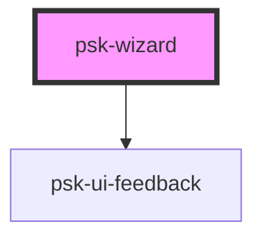

# psk-wizard

<!-- Auto Generated Below -->

## Properties

| Property      | Attribute | Description | Type           | Default     |
| ------------- | --------- | ----------- | -------------- | ----------- |
| `wizardSteps` | --        |             | `WizardStep[]` | `undefined` |

## Events

| Event                     | Description | Type               |
| ------------------------- | ----------- | ------------------ |
| `changeStep`              |             | `CustomEvent<any>` |
| `finishWizard`            |             | `CustomEvent<any>` |
| `needWizardConfiguration` |             | `CustomEvent<any>` |

## Dependencies

### Depends on

- [psk-ui-feedback](../psk-ui-feedback)

### Graph

----------------------------------------------

*Built with [StencilJS](https://stenciljs.com/)*
