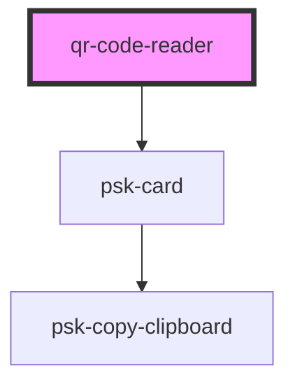

# qr-code-reader

<!-- Auto Generated Below -->

## Properties

| Property | Attribute | Description | Type     | Default     |
| -------- | --------- | ----------- | -------- | ----------- |
| `data`   | `data`    |             | `any`    | `undefined` |
| `title`  | `title`   |             | `string` | `""`        |

## Dependencies

### Depends on

- [psk-card](../../psk-card)

### Graph

----------------------------------------------

*Built with [StencilJS](https://stenciljs.com/)*
