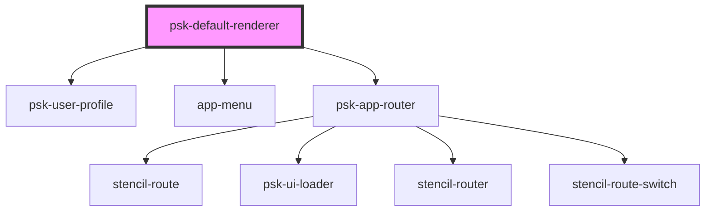

# psk-default-render

<!-- Auto Generated Below -->

## Properties

| Property      | Attribute      | Description | Type                  | Default     |
| ------------- | -------------- | ----------- | --------------------- | ----------- |
| `historyType` | `history-type` |             | `"browser" \| "hash"` | `undefined` |

## Dependencies

### Depends on

- [psk-user-profile](..\..\psk-user-profile)
- [app-menu](..\..\app-menu)
- [psk-app-router](..\..\psk-app-router)

### Graph

----------------------------------------------

*Built with [StencilJS](https://stenciljs.com/)*
